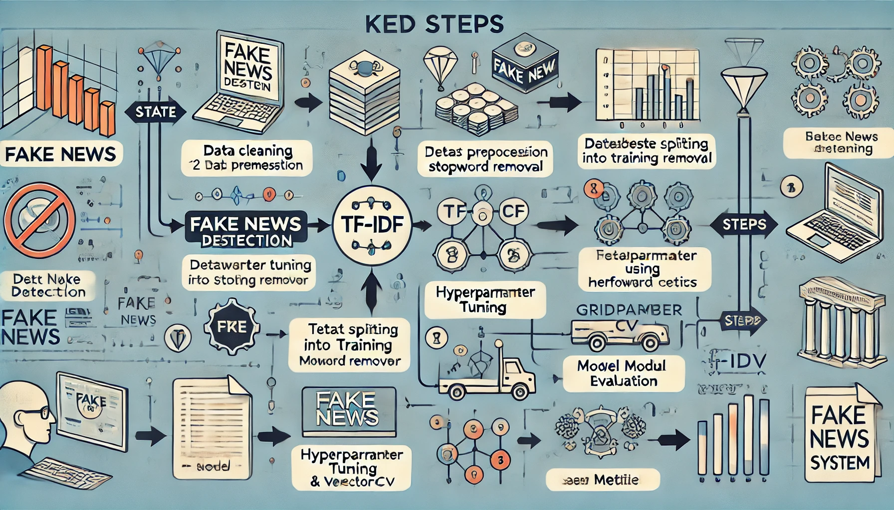

# **Fake News Detection Using Passive-Aggressive Classifier with Hyperparameter Tuning**

This project implements a **Fake News Detection System** using machine learning. The system classifies news articles as "Real" or "Fake" based on their textual content. It incorporates **TF-IDF Vectorization**, a **Passive-Aggressive Classifier**, and **hyperparameter tuning** to enhance performance.

---

## **Table of Contents**
- [Introduction](#introduction)
- [Dataset](#dataset)
- [Technologies Used](#technologies-used)
- [Workflow](#workflow)
- [Installation](#installation)
- [Usage](#usage)
- [Results](#results)
- [Contributions](#contributions)
- [Future Work](#future-work)

---

## **Introduction**
Fake news poses a significant challenge in today's digital era. With the rapid spread of misinformation, an efficient system to detect fake news is essential. This project uses a machine learning approach to analyze and classify news articles.

---

## **Dataset**
- **Source:** [Dataset Link](https://github.com/abiek12/Fake-News-Detection-using-MachineLearning/tree/main/dataset)
- The dataset contains labeled news articles, with labels `1` for fake news and `0` for real news.
- **Preprocessing Steps:**
  - Dropped unnecessary columns like `author`, `title`, and `id`.
  - Removed null values and reset the dataset index.
  - Applied lemmatization and stopword removal to clean the text data.

---

## **Technologies Used**
- **Languages:** Python
- **Libraries:** 
  - Machine Learning: `scikit-learn`
  - Text Processing: `nltk`, `re`
  - Visualization: `matplotlib`, `seaborn`
  - Utilities: `pandas`, `numpy`, `joblib`
  - API request: `requests`
  - Server: `Flask`
  - Web GUI:`Streamlit`

---

## **Workflow**

 

The project follows these steps:
1. **Data Cleaning**: Remove unnecessary columns and handle missing values.
2. **Text Preprocessing**: Apply lemmatization and stopword removal.
3. **Dataset Splitting**: Divide data into training (80%) and testing (20%).
4. **TF-IDF Vectorization**: Convert textual data into numerical features.
5. **Model Training**: Train a Passive-Aggressive Classifier.
6. **Hyperparameter Tuning**: Optimize the classifier using GridSearchCV.
7. **Evaluation**: Measure performance with metrics like accuracy, precision, recall, and F1-score.

---

## **Installation**
1. [Download and install python if not installed already](https://www.python.org/ftp/python/3.13.0/python-3.13.0-amd64.exe)
2. [Download and Install Github if not installed Already](https://central.github.com/deployments/desktop/desktop/latest/win32)
3. Clone the repository:
   ```bash
   git clone https://github.com/shadrach098/Fake_news-Detector.git
   ```
4. Navigate to the project directory:
   ```bash
   cd Fake_news-Detector
   ```
5. Install the required dependencies:
   ```bash
   pip install -r requirements.txt
   ```

---

## **Usage**
1. Make sure you still in the project directory. 
2. Run the Python script to Start The Flask :
   ```python
   py Flask_server.py
   ```
3. Since the Flask server is running,Open another terminal and navigate to the Repository directory.
    ```python
    cd Fake_news-Detector
    ```
5. Test the Saved Predict Model using API request and Steamlit GUI:
   ```streamlit
   streamlit run  GUI.py
   ```
   There should be a pop up in a web browser
6. To see the code on how the process of Training the models open the jupyter notebook
   ```Open With Jupyter notebook or Visual Studio code
   Fake_News_Detector-PA.ipynb
   ```  

---

## **Results**
### **Original Model Metrics:**
- **Accuracy:** 96%
- **Precision:** 96%
- **Recall:** 95%

### **Hyperparameter Tuned Model Metrics:**
- **Accuracy:** 96%
- **Precision:** 96%
- **Recall:** 96%


Although the metrics remained the same, hyperparameter tuning validated the optimal settings of the model.

---

## **Contributions**
- Applied **hyperparameter tuning** using GridSearchCV for systematic optimization.
- Integrated a predictive system for real-time fake news classification.
- Saved the trained model and vectorizer for reuse with `joblib`.


---

## **Future Work**
- Experiment with advanced NLP models like **BERT** for improved accuracy.
- Test the model on larger and more diverse datasets.
- Extend the system to multilingual fake news detection.

---

